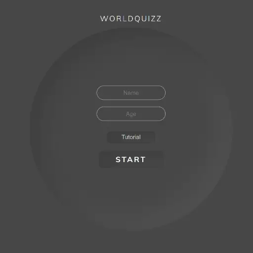
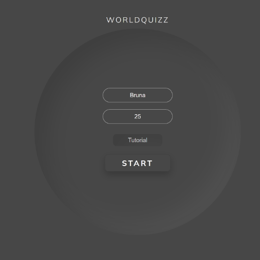
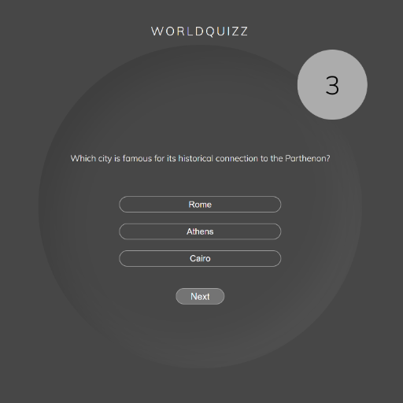

# WorldQuizz

World Quizz was created with the intention to bring general knowledge about Travel, Geography and Local Curiosity. 
You will find the questions not difficult to answer, it's probably things you already heard of back in school or while traveling yourself, otherwise, you just agregated knowledge.

You have one question, and three options for answer, from which only one is correct. A countdown timer is at the top-right corner, you have 10 seconds to answer the question.
There are 5 questions in total. 
An alert will display your score based on how many questions you answered correctly out of 5.

##Features

The Quizz was build to agregate knowledge. You will find the questions easy to asnwer, and be able to learn small bits of information, worldwide curiosities and facts, while playing an interesting and fun game. 

###Existing Features

-__Navigation Bar__

- Responsive navigation bar featuring Logo with a link to the Home page and a link to "Exit" the game.
- This section will allow the user to navigate through the Quiz easily.

-__User Inputs page__

- The index page consists of a User Input, where the name and age will be validated prior to starting the game.
- If both the name and age are provided, you can either start the quizz or see the tutorial with the instructions on how to play.

- __Tutorial__

- A small but descriptive tutorial with basic instructions has been added to help the First Time User to navigate easily through the Quiz.

-__Start Button__

- This button starts the Quiz after validating the User's Inputs. 
- Featuring a :hover animation.

-__Question and Answers Section__

- In this section, the question is presented with 3 options for asnwer. Only one of them is the correct answer.

-__Timer__

- A timer funtion has been added to give the User 10 second to select the correct answer. 

###Features to be be Implemented

-__LeaderBoard__
    
- This feature will allow the User to see how friends and family scored and display a leaderboard depending on your scores.

- Share button.

##Testing

* W3C Validator - Passed
* W3C CSS Validator - Passed
* [WAVE](#wave)

## BUGS

### Known Bugs

- Timer is not working properly even with ClearTimerInterval being adjusted.

### Solved Bugs

This is where all solved bugs go once squashed. List what the bug was, and how you managed to fix it. You can also include images/videos here if you wanted.

##Credits

 - UiVerse.

    
###Media

-__WireFrames__

- Made with "MarvelAp" LINK\
<iframe src="https://marvelapp.com/prototype/bj49j2h?emb=1&iosapp=false&frameless=false" width="1440" height="1024" allowTransparency="true" frameborder="0" style="-webkit-clip-path: inset(2px 2px); clip-path: inset(2px 2px);"></iframe>

-__Favicon__
    
- Made with "FavIcon Generator"
 https://favicon.io/

###Acknowledgements

#My Mentor - For all the support and knowledge shared throughout the development of this project.
