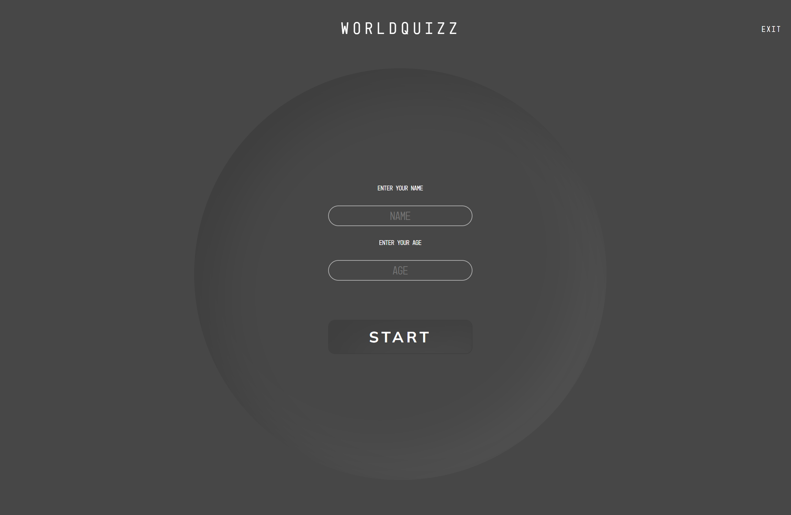
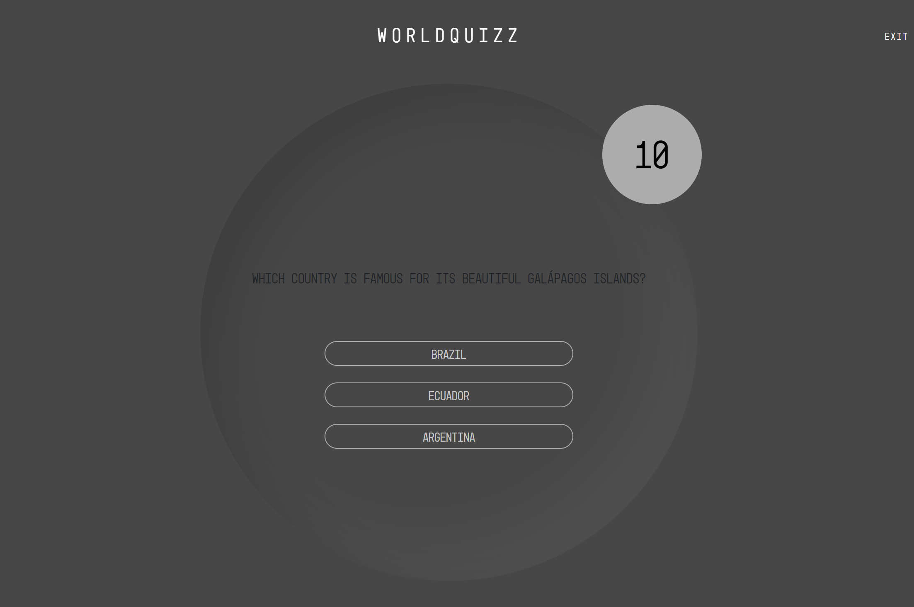
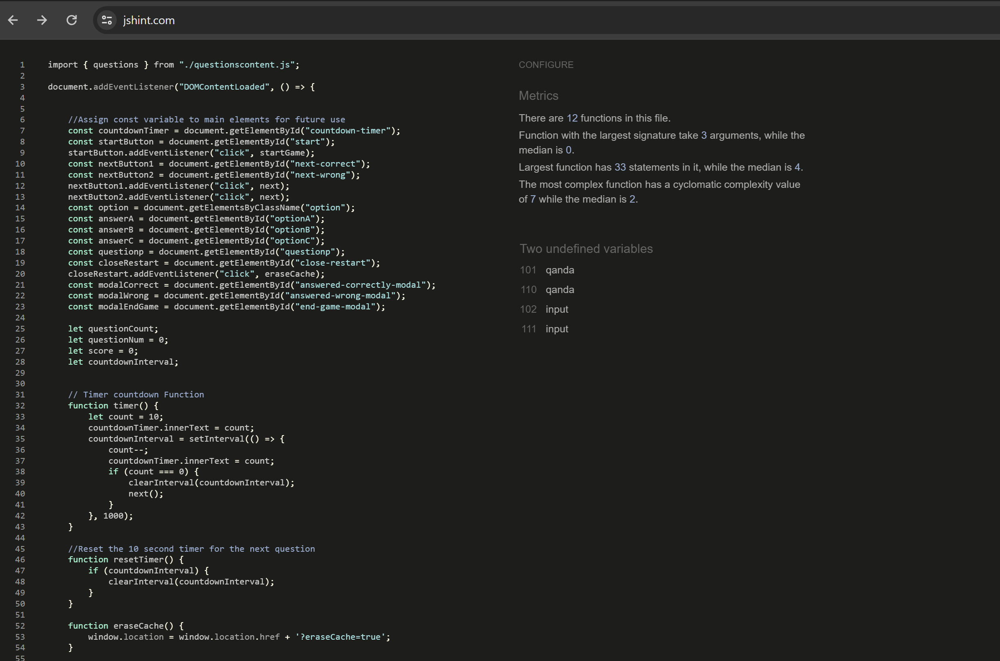
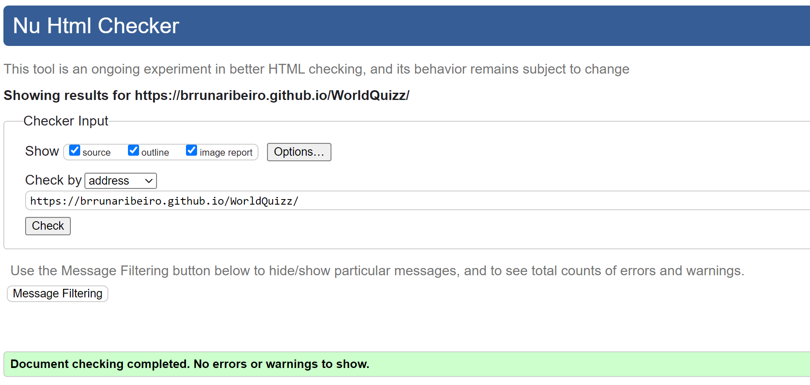
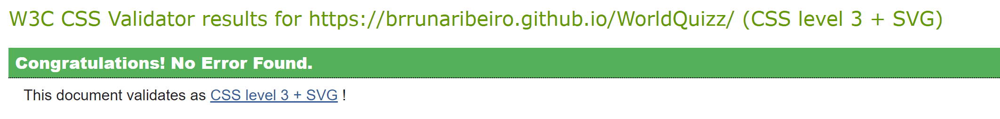
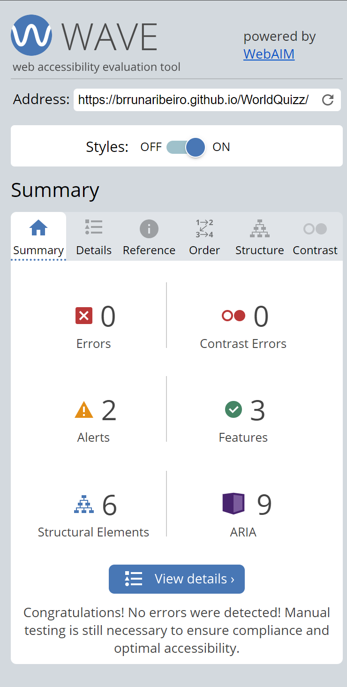
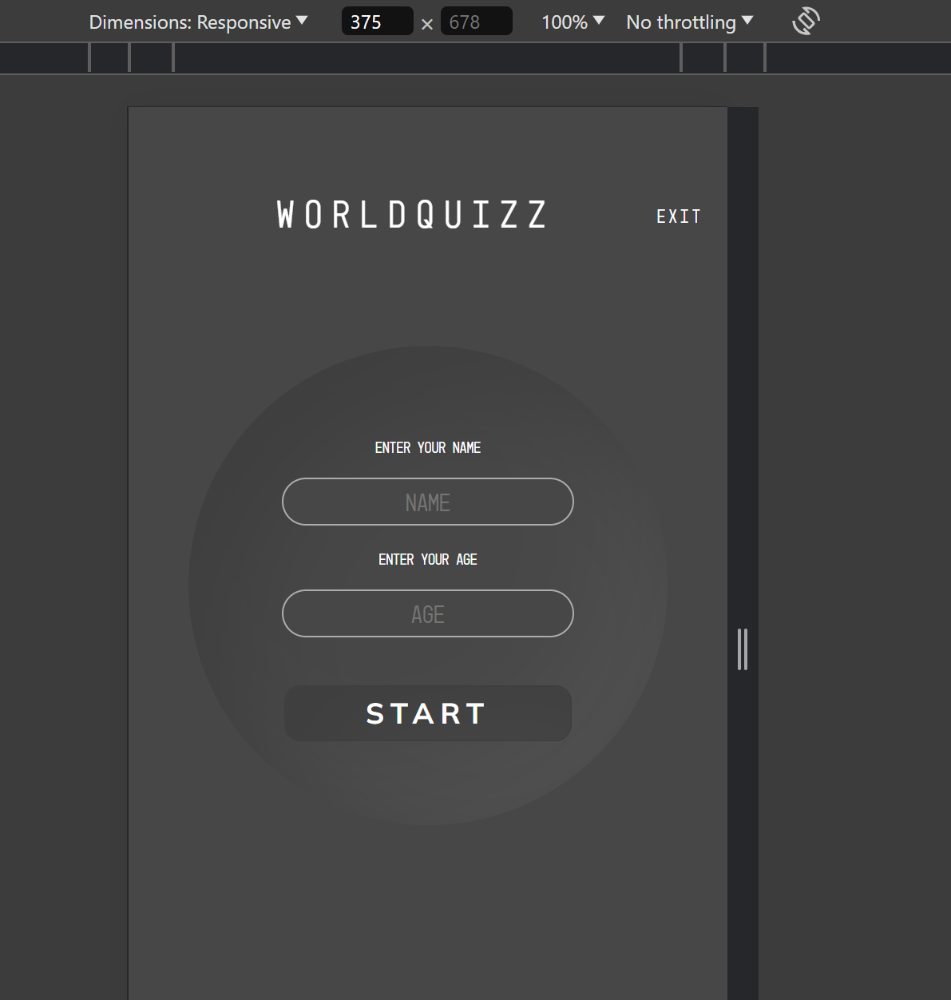
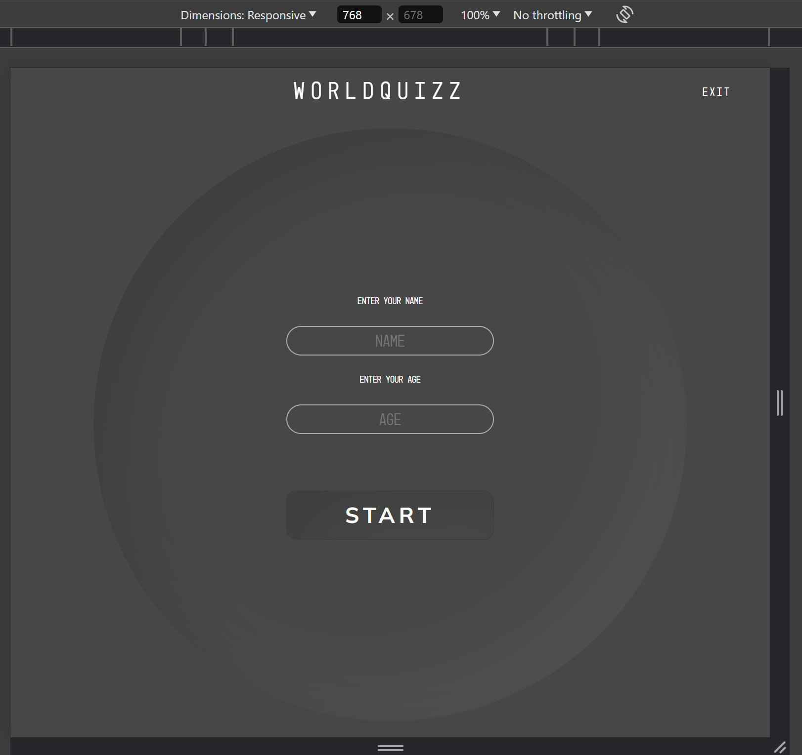
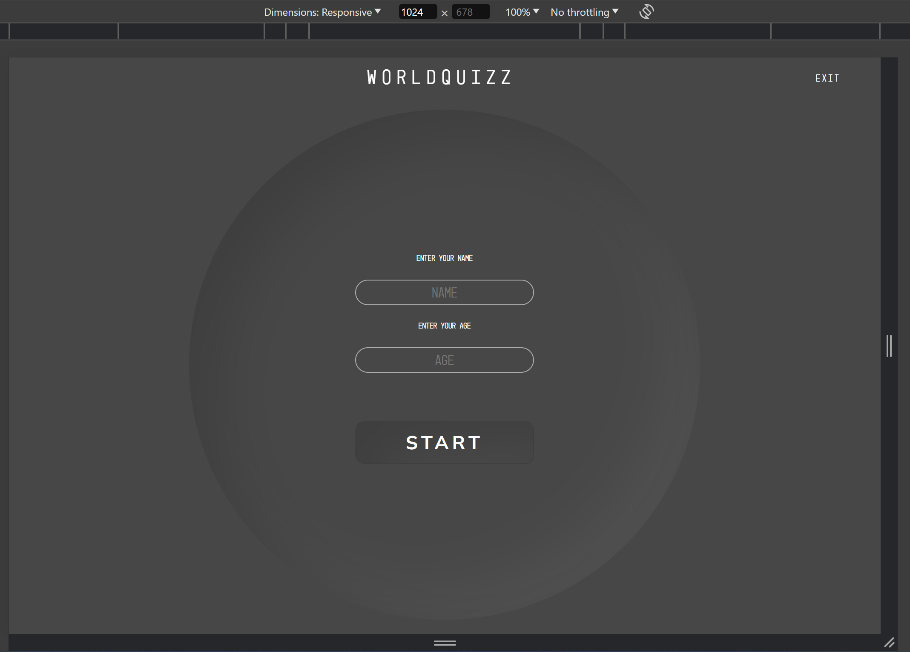
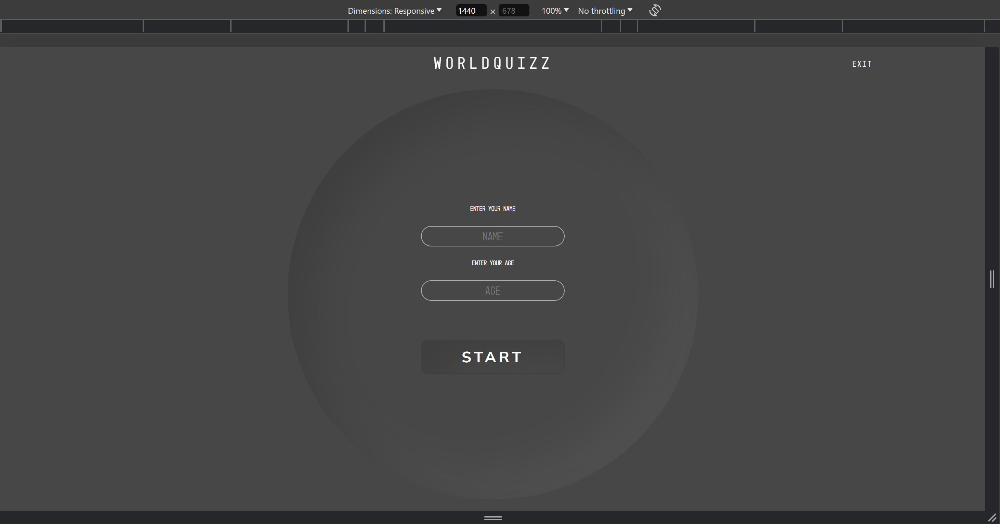

# WorldQuizz

[WorldQuizz](https://brrunaribeiro.github.io/WorldQuizz/)

World Quizz was created with the intention to bring general knowledge about Travel, Geography and Local Curiosities. 
You will find the questions not difficult to answer, it's probably things you already heard of, back in school or while traveling yourself, and otherwise, you might have just aggregated some knowledge.

For each question, there are three options for answer, from which, only ONE is correct. The game features a countdown timer which is at the top-right corner, you have 10 seconds to answer the question. When the timer runs out, you are redirected to the next question and your score remains the same.
There are 5 questions in total. You score +1 for each correctly answered question.

After 5 questions, you will see your final score.

## Features

The Quizz was build to aggregate knowledge. You will find the questions easy to answer, and be able to learn small bits of information, worldwide curiosities and facts, while playing an interesting and fun game. 

### Existing Features

- __Navigation Bar__

    - Responsive navigation bar featuring Logo with a link to the Home page and a link to "Exit" the game.
    - This section will allow the user to navigate through the Quiz easily.

- __User Inputs page__

    - The landing page consists of a User Input, where the name and age will be validated prior to starting the game.
    - If both the name and age are provided, you can either start the quizz.

- __Start Button__

    - This button starts the Quiz after validating the User's Inputs. 
    - Featuring a :hover animation.

- __Question and Answers Section__

    - In this section, the question is presented with 3 options for answer. Only one of them is the correct answer.
    - You have 10 seconds to answer the question.
    - After selecting one answer, the answer will be instantly validated and the user is informed if it is correct or wrong.
    - Each option for answer has a :hover effect for better UX.

- __Timer__

    - A timer function has been added to the game to make it more challenging. 
    - The timer has 10 seconds.
    - When the timer runs out, the user will automatically be presented the next question.

- __Modal instead of alerts__

    - In the latest deployment a Bootstrap Modal was introduced for better UI.
    - The modal is more appealing and can be easily styled.
    - Each time the answer is selected, a Modal will be shown to let the user know if the answer is correct or not. 
    - Each modal has an Icon with animation to enhance the game experience.
    - The modal can be closed by clicking next, or by clicking anywhere in the screen as long as the Modal is shown.
    - The in-between game Modal will redirect the user to the next question.
    - The "end of game" Modal shows the user the final score and prompts the user to start a new game.

### Features to be implemented

- __Leader Board__
    
    - This feature will allow the User to see how friends and family scored and display a leader board depending on your scores.
    - Ability to compare each round played's score.

- __In-Game Score__

    - In-game score with bars that become green(in case correctly answered) or red(in case incorrectly answered).

- __Share Options__

    - Share button to let the user share their score with friends and family with invitation to play the quiz.

- __Tutorial__

    - Video with basic explanation of the game and how to play it.

## Testing

- [JSHint](https://jshint.com/) - Passed.
    

- [W3C Validator](https://validator.w3.org/) - Passed.
    

- [W3C CSS Validator](https://jigsaw.w3.org/css-validator/) - Passed.
    

- [Wave](https://wave.webaim.org/) - Passed.

    

## Manual Testing

| Test Case                              | Steps                                                                  | Expected Result                                          | Passed/Failed |
|----------------------------------------|------------------------------------------------------------------------|----------------------------------------------------------|---------------|
| **Initial Form (User Input)**          |
| Input Fields Validation                |
| - Empty Age                            | Enter valid name, leave Age empty, click "Start"                       | Error message for Age field                              | Passed        |
| - Empty Name                           | Enter valid age, leave Name empty, click "Start"                       | Error message for Name field                             | Passed        |
| - Invalid Data Types                   | Enter text in Age field                                                | Only numbers are allowed                                 | Passed        |
| Accept Valid Inputs                    | Enter valid name and age, click "Start"                                | Form hides and quiz section appears                      | Passed        |
| **Question and Answers**       |
| Question Display                       | Ensure a question appears when quiz section is revealed                | Question displays                                        | Passed        |
| Button Click Events                    | Click each option button (A, B, C)                                     | Correct/Wrong modal appears based on selection           | Passed        |
| - Aria-label Check                     | Verify aria-label text for each button(A, B or C)                      | Aria-labels are present                                  | Passed        |
| **Modals** |
| Correct Answer Modal                   | Answer question correctly, correct modal displays                      | "Your answer is correct" modal appears                   | Passed        |
| - Correct Modal Animation              | Verify animation on icon                                               | Icon animates                                            | Passed        |
| - Next Question                        | Click "Next Question"                                                  | Modal closes and next question appears                   | Passed        |
| Wrong Answer Modal                     | Answer question incorrectly, ensure wrong modal displays               | "Your answer is wrong" modal appears                     | Passed        |
| - Wrong Modal Animation                | Verify animation on icon                                               | Icon animates                                            | Passed        |
| - Next Question                        | Click "Next Question"                                                  | Modal closes and next question appears                   | Passed        |
| **End Game Modal**                     |
| End of Quiz                            | Complete quiz and ensure end game modal appears                        | "Thank you for playing" modal appears                    | Passed        |
| Start a New Game                       | Click "Start a New Game"                                               | Restarts the game and initial input form appears         | Passed        |
| **Additional Tests**                   |
| Modal Transitions                      | Check modal transitions when closing one and opening another           | Transition present                                       | Passed        |
| Responsive Design                      | Test on different device sizes (mobile, tablet, desktop)               | Layout is responsive and user-friendly                   | Passed        |
| Click Outside the Modal                |
| - Correct Answer Modal                 | Click outside the "Correct Answer" modal                               | Modal closes as expected                                 | Passed        |
| - Wrong Answer Modal                   | Click outside the "Wrong Answer" modal                                 | Modal closes as expected                                 | Passed        |
| - End Game Modal                       | Click outside the "End Game" modal                                     | Modal closes as expected                                 | Passed        |

This Manual test indicates that all the tests have passed.

## Responsiveness

- Responsiveness was checked and adjusted with Chrome Developers Tools

## Deployment

Github Pages was used to deploy the live website. The instructions to achieve this are below:

- Log in (or sign up) to Github.
- Click on the Settings link.
- Click on the Pages link in the left hand side navigation bar.
- In the Source section, choose main from the drop down select branch menu. Select Root from the drop down select folder menu.
- Click Save. Your live Github Pages site is now deployed at the URL shown.

## Bugs

### Known Bugs
- No known bugs.

### Fixed bugs

- Timer is not working properly even with ClearTimerInterval being adjusted. FIXED
- The modal can be closed by clicking anywhere in the screen, however the game's logic stops and the game does not continues. FIXED.

## Credits

- [Uiverse](https://uiverse.io/) - Start Button.

- [W3C](https://www.w3schools.com/howto/howto_css_hide_arrow_number.asp) - Remove default appearance of the input field with "Number" type.

- [GeeksforGeeks](https://www.geeksforgeeks.org/shuffle-a-given-array-using-fisher-yates-shuffle-algorithm/) - Assisted to build the function to randomize the questions.

- [BoxIcons](https://boxicons.com/) - Icons for Modals.

### Media

- [MarvelApp](https://marvelapp.com/prototype/bj49j2h) - Start Button.

- [FavIcon Generator](https://favicon.io/) - FavIcon.

### Acknowledgements

- My Mentor - For all the support and knowledge shared throughout the development of this project.

- My family and friends -  For assisting with the Manual Testing and providing helpful feedback.

